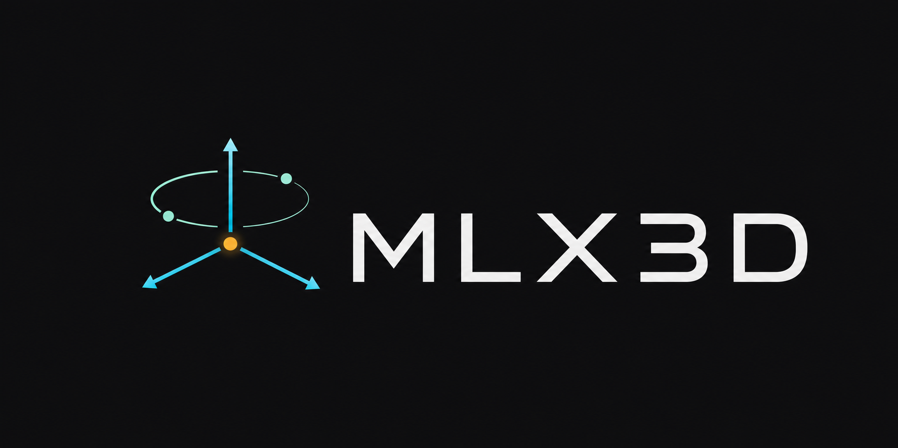

<p align="center">
  
</p>

# MLX3D

**Differentiable 3D computer vision on Apple Silicon, built on [MLX](https://github.com/ml-explore/mlx).**

MLX3D brings the PyTorch3D workflow to Macs: batched 3D data structures, cameras, differentiable rendering, and modern view synthesis — NeRF and **3D Gaussian Splatting with custom Metal kernels** — running natively on the Apple GPU.

📖 **[Documentation & tutorials](https://amirhossein-razlighi.github.io/mlx3D/)**

## Features

- **Structures** — batched `Meshes` / `Pointclouds` with list, packed and padded views; differentiable normals, areas, edges.
- **Cameras & transforms** — OpenCV/COLMAP-convention pinhole cameras (ray generation, projection, look-at) and batched rotation conversions (quaternion, axis-angle, Euler, 6D).
- **Ops & losses** — GPU brute-force k-NN, chamfer distance, area-weighted surface sampling, Laplacian/edge/normal-consistency mesh losses, PSNR and differentiable SSIM.
- **NeRF** — positional encoding, the NeRF MLP, stratified + hierarchical sampling, volume rendering, Blender-synthetic dataset loader.
- **Mesh rendering** — differentiable soft triangle rasterization, UV texture sampling for OBJ/MTL assets, and scalar-field mesh extraction.
- **Gaussian Splatting** — a Metal translation of the reference CUDA rasterizer (tile-based forward & backward kernels wrapped in `mx.custom_function`), EWA projection, spherical harmonics, adaptive density control, COLMAP loading, and standard 3DGS `.ply` checkpoints. ~30 FPS forward at 720p with 100k Gaussians on an M-series GPU.
- **Interactive viewer** — `mlx3d-view point_cloud.ply` opens a browser viewer with orbit/pan/zoom; frames are rendered on the Apple GPU by the Metal rasterizer and streamed live. Works for NeRFs too.
- **IO** — OBJ and PLY (ascii + binary, including Gaussian Splatting checkpoint layouts), plus one-line image `save_image` / `load_image` for any renderer output.
- **Composable & extensible** — every image renderer is a plain callable `(camera, scene) -> {"image", "alpha", "depth"}` (the [`Renderer`](src/mlx3d/renderer/protocols.py) protocol), so you can drop in your own rasterizer, shader, or ray tracer and reuse the rest of the pipeline — no base classes to subclass.

## Installation

```bash
pip install mlx3d
```

Requires an Apple Silicon Mac and Python ≥ 3.10.

## Quick example

```python
import mlx.core as mx
from mlx3d.cameras import Camera
from mlx3d.splatting import GaussianModel

model = GaussianModel.from_points(
    points=mx.random.normal((10_000, 3)) * 0.5,
    colors=mx.random.uniform(shape=(10_000, 3)),
)
camera = Camera.look_at(eye=(0, 0, -4), at=(0, 0, 0), width=1280, height=720)
out = model.render(camera)            # differentiable end to end
print(out["image"].shape)             # (720, 1280, 3)
```

Train Gaussian Splatting on any COLMAP scene (same inputs as the original 3DGS):

```bash
python examples/train_gaussian_splatting.py --data /path/to/scene --iters 7000
mlx3d-view outputs/gs/point_cloud.ply   # inspect the result interactively
```

More in the docs: [mesh optimization](https://amirhossein-razlighi.github.io/mlx3D/tutorials/mesh_optimization/), [point cloud fitting](https://amirhossein-razlighi.github.io/mlx3D/tutorials/pointcloud_fitting/), [NeRF](https://amirhossein-razlighi.github.io/mlx3D/tutorials/nerf/), [Gaussian Splatting](https://amirhossein-razlighi.github.io/mlx3D/tutorials/gaussian_splatting/).

## Examples

The [`examples/`](examples/) folder has runnable scripts for every core feature.
The self-contained ones generate their own synthetic data — no downloads — and
finish in seconds:

```bash
uv run python examples/render_mesh.py        # soft mesh rasterization
uv run python examples/raytrace_volume.py    # ray casting + volume rendering
uv run python examples/extract_mesh.py       # marching cubes from an SDF
uv run python examples/fit_pointcloud.py     # point-cloud optimization
uv run python examples/fit_mesh.py           # mesh fitting (chamfer + regularizers)
uv run python examples/fit_nerf.py           # train a small NeRF
uv run python examples/fit_gaussians.py      # fit 3D Gaussians
uv run python examples/extend_renderer.py    # plug in a custom renderer
```

See [`examples/README.md`](examples/README.md) for the full list, including the
COLMAP/Blender training scripts.

## Development

Development uses [uv](https://docs.astral.sh/uv/):

```bash
git clone https://github.com/amirhossein-razlighi/mlx3D
cd mlx3D
uv sync               # creates .venv with all dev dependencies
uv run pytest tests/
uv run mkdocs serve   # docs at http://127.0.0.1:8000
```

Contributions are welcome — file an issue to get started.

## Roadmap

- [x] Meshes / Pointclouds structures, cameras, transforms
- [x] OBJ / PLY IO
- [x] knn, chamfer, surface sampling, mesh losses, SSIM/PSNR
- [x] NeRF (hierarchical sampling, volume rendering)
- [x] Differentiable point splatting renderer
- [x] 3D Gaussian Splatting with Metal forward/backward kernels
- [x] COLMAP / Blender dataset loaders
- [x] Differentiable mesh rasterizer (soft rasterization)
- [x] Textured mesh rendering (`.mtl`, UV textures)
- [x] Optimizer-state-preserving densification for 3DGS
- [x] Configurable 3DGS training method with vanilla default and MCMC-style fixed-budget relocation
- [x] 2DGS / surfel-style Gaussian mode with local-normal thickness constraints
- [ ] 2DGS geometry losses and surface extraction refinements
- [ ] Additional well-known splatting recipes (anti-aliasing, compression, 3DGUT-style variants)
- [x] Viewer depth-map mode for Gaussian checkpoints
- [x] Viewer mesh-style inspection with GPU-efficient depth contours
- [x] Marching cubes / mesh extraction
- [x] More acceleration structures (hash-grid encodings for NeRF)

## License

MIT
