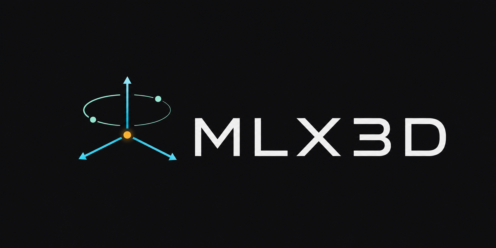
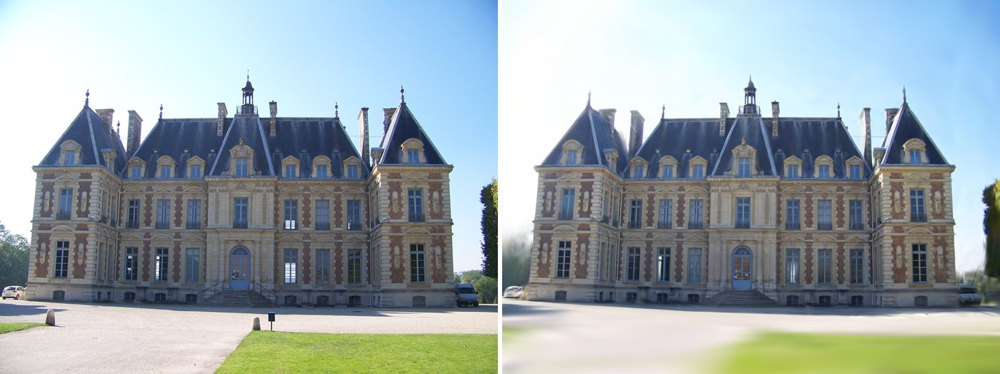
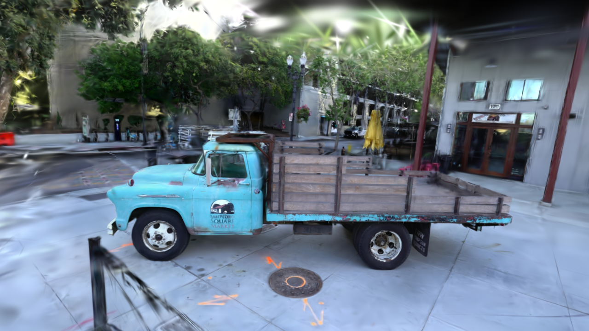
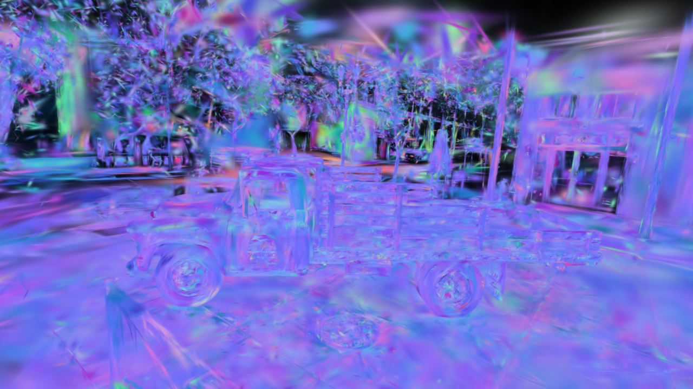
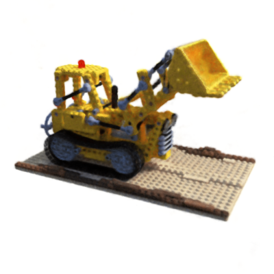
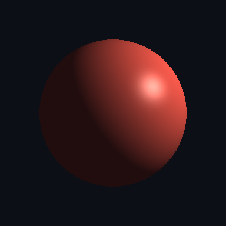

<p align="center">
  
</p>

# MLX3D

<p align="center">
  <a href="https://pypi.org/project/mlx3d/"></a>
  <a href="https://pypi.org/project/mlx3d/"></a>
  <a href="https://github.com/amirhossein-razlighi/mlx3D/actions/workflows/tests.yml"></a>
  <a href="https://amirhossein-razlighi.github.io/mlx3D/"></a>
  <a href="LICENSE"></a>
</p>

**Differentiable 3D computer vision on Apple Silicon, built on [MLX](https://github.com/ml-explore/mlx).**

MLX3D brings the PyTorch3D workflow to Macs: batched 3D data structures, cameras, differentiable rendering, and modern view synthesis — NeRF and **3D Gaussian Splatting with custom Metal kernels** — running natively on the Apple GPU.

📖 **[Documentation & tutorials](https://amirhossein-razlighi.github.io/mlx3D/)**

## Features

- **Structures** — batched `Meshes` / `Pointclouds` with list, packed and padded views; differentiable normals, areas, edges.
- **Cameras & transforms** — OpenCV/COLMAP-convention pinhole cameras (ray generation, projection, look-at) and batched rotation conversions (quaternion, axis-angle, Euler, 6D).
- **Ops & losses** — GPU brute-force k-NN, chamfer distance, area-weighted surface sampling, Laplacian/edge/normal-consistency mesh losses, PSNR and differentiable SSIM.
- **NeRF** — positional encoding, the NeRF MLP, stratified + hierarchical sampling, volume rendering, Blender-synthetic dataset loader.
- **Mesh rendering** — differentiable soft triangle rasterization, UV texture sampling for OBJ/MTL assets, and scalar-field mesh extraction.
- **Gaussian Splatting** — a Metal translation of the reference CUDA rasterizer (tile-based forward & backward kernels wrapped in `mx.custom_function`), EWA projection, spherical harmonics, anti-aliased and arbitrary feature rendering, adaptive density control, COLMAP loading, and standard 3DGS `.ply` checkpoints. ~30 FPS forward at 720p with 100k Gaussians on an M-series GPU.
- **Capture pipeline** — `mlx3d-capture photos_or_video` goes from raw photos or a phone video to a trained splat in one resumable command: sharp-frame selection, COLMAP or built-in COLMAP-free SfM (with joint pose refinement during training), live training preview, and a compacted `.ply` export.
- **Interactive viewer** — `mlx3d-view point_cloud.ply` opens a browser viewer with orbit/pan/zoom; frames are rendered on the Apple GPU by the Metal rasterizer and streamed live. Works for NeRFs too.
- **IO** — OBJ and PLY (ascii + binary, including Gaussian Splatting checkpoint layouts), plus one-line image `save_image` / `load_image` for any renderer output.
- **Composable & extensible** — every image renderer is a plain callable `(camera, scene) -> {"image", "alpha", "depth"}` (the [`Renderer`](src/mlx3d/renderer/protocols.py) protocol), so you can drop in your own rasterizer, shader, or ray tracer and reuse the rest of the pipeline — no base classes to subclass.

## Installation

```bash
pip install mlx3d
```

Requires an Apple Silicon Mac and Python ≥ 3.10.

## Photos → splat in minutes

Turn a folder of photos — or a phone video — into a trained 3D Gaussian Splat
with one command, entirely on your Mac:

```bash
mlx3d-capture ./my_photos/          # or: mlx3d-capture walkaround.mp4
```

<p align="center">
  
  <br/>
  <em>11 photos in, splat out — input photo (left) vs. the trained splat (right), poses from the built-in COLMAP-free SfM, ~5 minutes on an M-series laptop.</em>
</p>

This runs the whole pipeline: frame extraction (with automatic motion-blur
filtering for video) → camera poses → 3DGS training with a **live browser
viewer** → a compacted `splat.ply` you can open in any splat viewer. Poses
come from COLMAP when it's installed (`brew install colmap`); otherwise
mlx3d's **built-in COLMAP-free SfM** (`pip install "mlx3d[capture]"`) handles
them and the trainer refines poses jointly with the splats. Stages are cached,
so re-runs resume where they left off.

```bash
mlx3d-capture clip.mp4 --quality fast     # quick preview
mlx3d-capture ./my_photos/ --quality best # 30k iterations, full resolution
```

See the [capture tutorial](https://amirhossein-razlighi.github.io/mlx3D/tutorials/capture/)
for capture tips and every option.

## Quick example

```python
import mlx.core as mx
from mlx3d.cameras import Camera
from mlx3d.splatting import GaussianModel

model = GaussianModel.from_points(
    points=mx.random.normal((10_000, 3)) * 0.5,
    colors=mx.random.uniform(shape=(10_000, 3)),
)
camera = Camera.look_at(eye=(0, 0, -4), at=(0, 0, 0), width=1280, height=720)
out = model.render(camera)            # differentiable end to end
print(out["image"].shape)             # (720, 1280, 3)
```

Train Gaussian Splatting on any COLMAP scene (same inputs as the original 3DGS):

```bash
python examples/train_gaussian_splatting.py --data /path/to/scene --iters 7000
mlx3d-view outputs/gs/point_cloud.ply   # inspect the result interactively
mlx3d-render outputs/gs/point_cloud.ply --out render.png --antialias
mlx3d-eval outputs/gs/point_cloud.ply --data /path/to/scene --views 20 --json-out metrics.json
mlx3d-compact outputs/gs/point_cloud.ply --out point_cloud_small.ply --max-gaussians 500000
```

More in the docs: [mesh optimization](https://amirhossein-razlighi.github.io/mlx3D/tutorials/mesh_optimization/), [point cloud fitting](https://amirhossein-razlighi.github.io/mlx3D/tutorials/pointcloud_fitting/), [NeRF](https://amirhossein-razlighi.github.io/mlx3D/tutorials/nerf/), [Gaussian Splatting](https://amirhossein-razlighi.github.io/mlx3D/tutorials/gaussian_splatting/).

## Gallery

<table>
  <tr>
    <td align="center" width="50%">
      <br/>
      <em>3D Gaussian Splatting (Tanks&nbsp;&amp;&nbsp;Temples truck), Metal rasterizer</em>
    </td>
    <td align="center" width="50%">
      <br/>
      <em>The same splat rendered as normals — any per-Gaussian feature works</em>
    </td>
  </tr>
  <tr>
    <td align="center" width="50%">
      <br/>
      <em>Instant-NGP-style hash-grid NeRF (Blender Lego)</em>
    </td>
    <td align="center" width="50%">
      <br/>
      <em>Differentiable mesh rendering with Phong shading</em>
    </td>
  </tr>
</table>

## Examples

The [`examples/`](examples/) folder has runnable scripts for every core feature.
The self-contained ones generate their own synthetic data — no downloads — and
finish in seconds:

```bash
uv run python examples/render_mesh.py        # soft mesh rasterization
uv run python examples/raytrace_volume.py    # ray casting + volume rendering
uv run python examples/extract_mesh.py       # marching cubes from an SDF
uv run python examples/fit_pointcloud.py     # point-cloud optimization
uv run python examples/fit_mesh.py           # mesh fitting (chamfer + regularizers)
uv run python examples/fit_nerf.py           # train a small NeRF
uv run python examples/fit_gaussians.py      # fit 3D Gaussians
uv run python examples/extend_renderer.py    # plug in a custom renderer
```

See [`examples/README.md`](examples/README.md) for the full list, including the
COLMAP/Blender training scripts.

## Development

Development uses [uv](https://docs.astral.sh/uv/):

```bash
git clone https://github.com/amirhossein-razlighi/mlx3D
cd mlx3D
uv sync               # creates .venv with all dev dependencies
uv run pytest tests/
uv run mkdocs serve   # docs at http://127.0.0.1:8000
```

Prefer plain pip? The package installs editable with the standard dev extra:

```bash
python -m venv .venv && source .venv/bin/activate
pip install -e ".[dev]"
pytest
```

> [!NOTE]
> `uv`-created `.venv`s do not ship their own `pip`. Inside one, use
> `uv pip ...` (or `uv run ...`); a bare `pip` may resolve to a different
> Python and silently install into the wrong environment.

Contributions are welcome — see [CONTRIBUTING.md](CONTRIBUTING.md) for the
workflow and guidelines, or file an issue to get started.

## License

MIT
