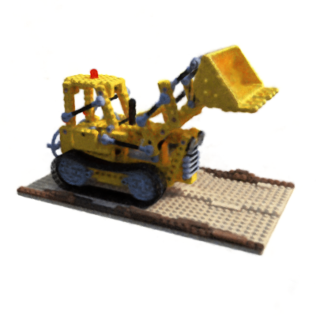
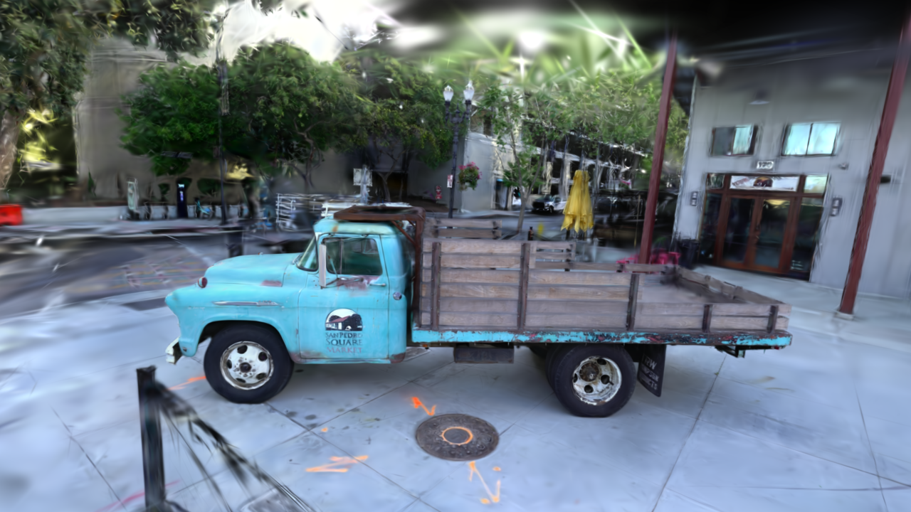
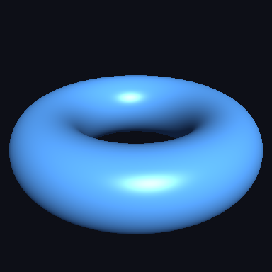

# MLX3D

**Differentiable 3D computer vision on Apple Silicon, built on [MLX](https://github.com/ml-explore/mlx).**

MLX3D brings the PyTorch3D workflow to Macs: batched 3D data structures, cameras, differentiable rendering, and modern view-synthesis methods (NeRF and 3D Gaussian Splatting) — all running natively on the Apple GPU through MLX, with the Gaussian Splatting and mesh rasterizers implemented as custom Metal kernels.

<p align="center">
  
  
  
  
</p>
<p align="center"><em>All rendered through MLX3D: a Phong-lit mesh, a hash-grid NeRF on the Lego scene, a 3D Gaussian Splatting checkpoint trained on the truck scene, and two-sided mesh shading.</em></p>

## Highlights

- **Data structures** — batched [`Meshes`](api/structures.md) and [`Pointclouds`](api/structures.md) with list / packed / padded views, differentiable through construction.
- **Cameras & transforms** — OpenCV-convention pinhole [`Camera`](api/cameras.md) (drop-in for COLMAP / NeRF datasets) and a full set of [rotation conversions](api/transforms.md).
- **Geometry ops & losses** — k-NN, chamfer distance, surface sampling, Laplacian smoothing, edge length and normal consistency losses, PSNR/SSIM.
- **NeRF** — positional encoding, the NeRF MLP, stratified + hierarchical sampling and volume rendering, with a training script for the Blender synthetic scenes.
- **Mesh rendering** — differentiable soft triangle rasterization, OBJ/MTL texture loading and UV sampling, plus scalar-field mesh extraction.
- **3D Gaussian Splatting** — a Metal translation of the reference CUDA rasterizer: tile-based forward and backward kernels wrapped in `mx.custom_function`, EWA and 3DGUT-style UT projection, spherical harmonics, anti-aliased and arbitrary feature rendering, adaptive density control, COLMAP loading, and standard `.ply` checkpoints viewable in any splat viewer.
- **Interactive viewer** — [`mlx3d-view`](viewer.md) opens any 3DGS checkpoint in the browser with orbit/pan/zoom, rendered live by the Metal kernels; NeRFs are supported too.
- **IO** — OBJ and PLY (ascii/binary) loading and saving, including 3DGS checkpoint layouts.

## What is new in 0.2.0

<p align="center"></p>

The 0.2.0 release focuses on production use: `mlx3d-render`, `mlx3d-eval`,
and `mlx3d-compact` CLIs; textured glTF import/export; PBR-style mesh shading;
2DGS geometry regularizers and surfel extraction helpers; Mip-Splatting-style
anti-aliasing; arbitrary-channel Gaussian feature rendering; and a
3DGUT-style Unscented Transform projection path for distorted/fisheye cameras.

## Installation

```bash
pip install mlx3d
```

Requires an Apple Silicon Mac (M1 or newer) and Python ≥ 3.10.

## A 60-second taste

```python
import mlx.core as mx
from mlx3d.cameras import Camera
from mlx3d.splatting import GaussianModel

# Random colored Gaussians...
model = GaussianModel.from_points(
    points=mx.random.normal((10_000, 3)) * 0.5,
    colors=mx.random.uniform(shape=(10_000, 3)),
)

# ...rendered from a camera, differentiably, on the Apple GPU.
camera = Camera.look_at(eye=(0, 0, -4), at=(0, 0, 0), width=1280, height=720)
out = model.render(camera)
print(out["image"].shape)  # (720, 1280, 3)
```

For checkpoints and mesh assets, render from the shell:

```bash
mlx3d-render point_cloud.ply --out render.png --antialias
mlx3d-render mesh.glb --type mesh --mode depth --out depth.png
mlx3d-eval point_cloud.ply --data scene/ --format colmap --views 20
```

Continue with the [Quickstart](quickstart.md), then pick a tutorial:

| Tutorial | What you build |
|---|---|
| [Mesh Optimization](tutorials/mesh_optimization.md) | Deform a sphere into a target shape with chamfer + regularizers |
| [Point Cloud Fitting](tutorials/pointcloud_fitting.md) | Optimize raw points with chamfer distance |
| [NeRF](tutorials/nerf.md) | Train a neural radiance field on the Blender synthetic scenes |
| [Gaussian Splatting](tutorials/gaussian_splatting.md) | Train 3DGS on a COLMAP scene with the Metal rasterizer |
