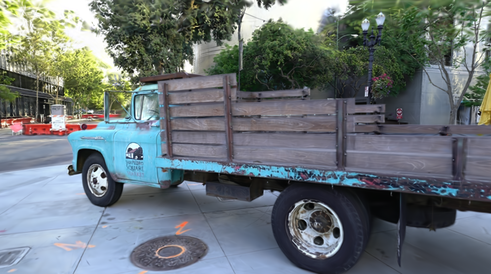
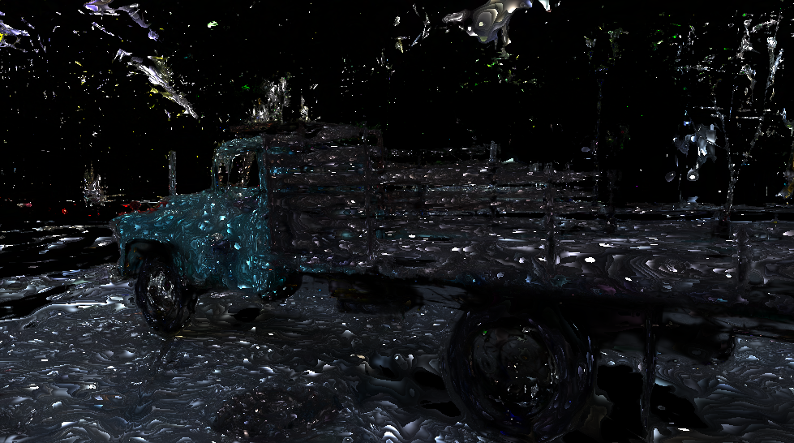
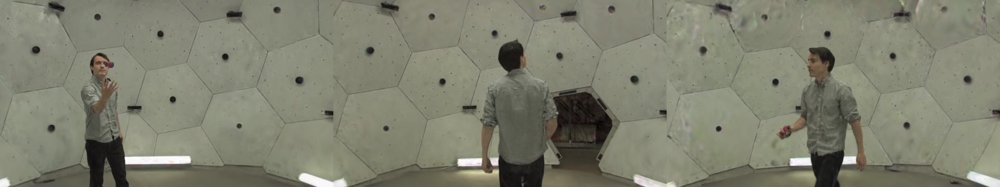

# Fast Splat Viewing

`FastGaussianRenderer` is a forward-only rendering path for 3D Gaussian
Splatting that trades autodiff support for speed: **1.5–2× faster** than the
training rasterizer on typical scenes and **up to 3.7×** when large splats
cover many pixels — while matching it pixel-for-pixel (45+ dB PSNR on real
scenes).

It adapts the ideas of
[fast-gaussian-rasterization](https://github.com/dendenxu/fast-gaussian-rasterization)
(a CUDA/OpenGL geometry-shader pipeline) to Metal compute kernels and MLX's
lazy graphs. Use it anywhere you only need images: the interactive viewer,
flythrough export, evaluation sweeps, and dynamic (4D) sequence playback.
Training still uses the differentiable
[`render_gaussians`](../api/splatting.md).

<p align="center">
  
  <br/>
  <em>Tanks &amp; Temples truck (428k Gaussians) rendered by the fast path —
  45.5 dB PSNR against the training rasterizer, at 2× the frame rate.</em>
</p>

## Usage

```python
from mlx3d.splatting import FastGaussianRenderer, GaussianModel

model = GaussianModel.load_ply("point_cloud.ply")
renderer = FastGaussianRenderer(model)       # caches activations, covariances, SH
out = renderer.render(camera)                # {"image", "alpha"}
```

Everything is also reachable from the CLI:

```bash
mlx3d-view point_cloud.ply --fast            # interactive viewer, fast RGB frames
mlx3d-render point_cloud.ply --fast --out render.png
python examples/benchmark_fast_rasterization.py --ply point_cloud.ply
```

One-shot functional form (mirrors `render_gaussians`, no cross-frame caching):

```python
from mlx3d.splatting import render_gaussians_fast

out = render_gaussians_fast(camera, means, quats, scales_act, opacities_act, sh=sh)
```

Useful knobs on the class:

- `sh_degree=0..3` — cap the evaluated spherical-harmonic degree (0 is
  fastest, view-independent color).
- `t_min` — early-termination transmittance. The default `1/255` stops
  compositing as soon as no further splat could change an 8-bit pixel
  (training uses `1e-4`).
- `color_refresh` — fraction of the scene radius the camera must move before
  view-dependent SH colors are re-evaluated (`0` = every frame).
- `antialias=True` — Mip-Splatting opacity compensation, as in training.

## Why it is faster

The training rasterizer must stay differentiable and rebuild everything every
frame. The fast path exploits the fact that a *viewer* renders the same scene
many times:

1. **One fused "geometry" kernel.** Camera transform, EWA projection,
   conics, culling, and tile bounds run in a single Metal pass per Gaussian —
   replacing ~60 elementwise MLX ops (~3.3 ms → 0.4 ms for 200k Gaussians).
2. **Cross-frame caching.** Activations (`exp`/`sigmoid`), 3D covariances,
   and SH-evaluated colors are computed once; colors refresh only when the
   camera moves enough to matter.
3. **Cheaper sorting.** Gaussians are depth-sorted once globally (N keys),
   so tile duplicates are emitted already depth-ordered and only a *stable
   32-bit* tile-key sort remains — the training path sorts 64-bit
   `(tile, depth)` keys over every duplicate.
4. **No mid-frame CPU/GPU sync.** Duplicate buffers persist across frames
   and grow on demand, so a whole frame is submitted as one lazy graph. The
   training path must stall mid-frame to size its buffers.
5. **Forward-only compositing.** No backward bookkeeping, fp16 splat colors
   (conics stay fp32 — near-camera footprints underflow half precision), and
   an 8-bit-aware early-out.

## Benchmarks

Apple M1 Pro (16 GB), macOS, MLX 0.31. Orbiting camera; mean frame latency.

### Real scene — Tanks & Temples truck (428k Gaussians, SH 3)

| viewpoint set | resolution | reference | fast | speedup | PSNR |
|---|---|---|---|---|---|
| dataset cameras | 979×546 | 63.9 ms (15.6 fps) | 30.8 ms (32.4 fps) | **2.07×** | 45–49 dB |
| dataset cameras | 1958×1092 | 193.8 ms (5.2 fps) | 96.4 ms (10.4 fps) | **2.01×** | 45–49 dB |

<p align="center">
  
  
  <br/>
  <em>Left: training rasterizer. Right: |difference| of the two paths
  amplified 50× — the residual is fp16 color quantization noise.</em>
</p>

### Synthetic scenes

| scene | resolution | reference | fast | speedup |
|---|---|---|---|---|
| 50k Gaussians | 1280×720 | 10.3 ms (97 fps) | 7.0 ms (143 fps) | **1.48×** |
| 200k Gaussians | 1280×720 | 34.6 ms (29 fps) | 20.6 ms (49 fps) | **1.68×** |
| 500k Gaussians | 1280×720 | 75.8 ms (13 fps) | 37.2 ms (27 fps) | **2.04×** |
| 500k Gaussians | 1920×1080 | 131.5 ms (7.6 fps) | 62.2 ms (16 fps) | **2.11×** |
| 20k large splats | 1920×1080 | 237.7 ms (4.2 fps) | 63.9 ms (16 fps) | **3.72×** |

The advantage grows with the pixel-to-point ratio (large splats, high
resolution) — the same regime the original CUDA implementation highlights.

## Dynamic (4D) sequences

Because covariances, colors, and buffers are owned by the renderer,
`update()` makes per-timestep playback cheap. The
[Dynamic 3D Gaussians](https://dynamic3dgaussians.github.io/) *juggle*
sequence (336k Gaussians × 150 timesteps, per-timestep positions, rotations,
and colors):

```python
renderer = FastGaussianRenderer(**sequence.timestep(0))
for t in range(sequence.num_timesteps):
    renderer.update(**sequence.timestep(t))     # new means/quats/colors
    frame = renderer.render(camera)["image"]
```

| playback (640×360, orbiting) | ms / frame | fps |
|---|---|---|
| reference `render_gaussians` | 25.1 | 39.8 |
| **fast** (update + render) | **14.9** | **67.3** |

<p align="center">
  
  <br/>
  <em>Real-time 4D playback rendered entirely by the fast path
  (67 fps at this resolution on an M1 Pro).</em>
</p>

<p align="center">
  
  <br/>
  <em>Timesteps 0 / 60 / 120 of the orbit.</em>
</p>

See [`examples/play_dynamic_gaussians.py`](https://github.com/amirhossein-razlighi/mlx3D/blob/main/examples/play_dynamic_gaussians.py)
for the full loader (including how to fetch one scene of the release without
downloading the whole 11.5 GB archive).

## Limitations

- **Forward-only.** No gradients flow through `FastGaussianRenderer`; use
  `render_gaussians` for training and losses.
- EWA pinhole projection only (no `projection="ut"` distortion-aware mode).
- Splat colors are quantized to fp16 (worst-case ~0.1% per channel); if you
  need bit-exact output for evaluation metrics, render with the training
  path.
- Stale-color rendering (`color_refresh > 0`) is an approximation while the
  camera moves; set `color_refresh=0` for exact view-dependent color every
  frame.
