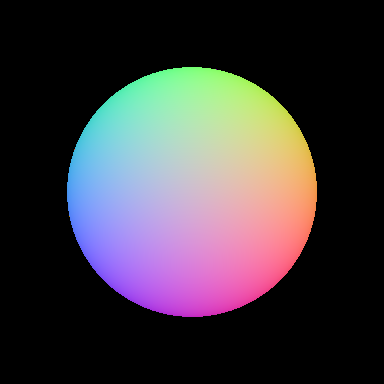
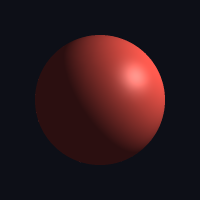
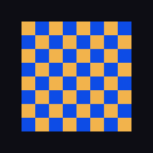

# Mesh rendering with lighting

MLX3D has two mesh rasterizers, mirroring the PyTorch3D split:

- [`rasterize_meshes`][mlx3d.renderer.rasterize_meshes] — a **hard z-buffer**
  rasterizer backed by a Metal kernel. It resolves visibility (nearest triangle
  per pixel) and returns [`Fragments`][mlx3d.renderer.Fragments]. Memory use is
  `O(H·W)`, so it stays fast at high resolution.
- [`render_mesh_soft`][mlx3d.renderer.render_mesh_soft] — a SoftRas-style
  rasterizer whose coverage is differentiable, for **silhouette gradients**.

Use the hard path for fast forward rendering and shading; reach for the soft one
when the loss needs gradients through the silhouette itself.

## A lit render in one call

[`render_mesh`][mlx3d.renderer.render_mesh] composes the rasterizer with a
Blinn-Phong shader and a list of lights, and returns
`{"image", "alpha", "depth", "normals"}`:

```python
import mlx.core as mx
from mlx3d.cameras import Camera
from mlx3d.renderer import render_mesh, PointLights, AmbientLights
from mlx3d.io import save_image
from mlx3d.utils import ico_sphere

mesh = ico_sphere(level=5, radius=1.0)
camera = Camera.look_at(eye=(2.4, 1.8, 2.4), at=(0, 0, 0), fov=45.0, width=512, height=512)

out = render_mesh(
    camera, mesh,
    verts_colors=mx.full((mesh.verts_packed().shape[0], 3), mx.array([0.85, 0.3, 0.25])),
    lights=[PointLights(location=(3, 3, -2)), AmbientLights(color=(0.15, 0.16, 0.2))],
    shininess=48.0, specular_strength=0.45, background=(0.05, 0.06, 0.09),
)
save_image("sphere.png", out["image"])
```

<p align="center">
  
  
</p>

The `normals` buffer is handy for debugging and for normal-based effects:

<p align="center"></p>

## Lights

Three light types are provided, all differentiable:

- [`PointLights`][mlx3d.renderer.PointLights] — a light at a world-space `location`.
- [`DirectionalLights`][mlx3d.renderer.DirectionalLights] — a light at infinity
  travelling along `direction`.
- [`AmbientLights`][mlx3d.renderer.AmbientLights] — uniform fill light.

Shading is **two-sided** by default: each normal is oriented toward the camera
before lighting, so meshes with inward or inconsistent winding (very common in
the wild) still light correctly instead of rendering black.

## PBR-style materials

Use `shading="pbr"` for a compact Cook-Torrance/GGX material preview with
base color, roughness, and metallic controls:

```python
out = render_mesh(
    camera, mesh,
    verts_colors=mx.full((mesh.verts_packed().shape[0], 3), mx.array([0.8, 0.25, 0.1])),
    lights=[PointLights(location=(3, 3, -2)), AmbientLights(color=(0.04, 0.04, 0.04))],
    shading="pbr",
    roughness=0.35,
    metallic=0.2,
)
```

This is not a full environment-lit offline renderer; it is a fast, differentiable
material model for inspecting glTF-style assets and optimizing material
parameters inside MLX.

In 0.2.0, `mlx3d-render` can load textured glTF/GLB meshes and forward uniform
glTF metallic/roughness factors into this PBR shader:

```bash
mlx3d-render model.glb --type mesh --out preview.png --shading pbr --ssaa 2
```

For asset-heavy workflows, this gives a quick local preview before you move to
a full DCC tool or game engine.

## Antialiasing and render passes

Pass `ssaa=N` to supersample (render at `N x` resolution and box-downsample) for
clean, antialiased silhouettes. `render_mesh` also returns extra render passes
(AOVs) alongside the image: `depth`, `normals`, `position` (world-space hit
point) and `face_id` (nearest face index, `-1` where empty).

```python
out = render_mesh(camera, mesh, ssaa=3)   # antialiased
seg = out["face_id"]                        # per-pixel face index
```

<p align="center"></p>

## Textured meshes

Pass a `texture` plus UV coordinates to shade from an image instead of vertex
colors. UVs are interpolated over the fragments and the texture is sampled
bilinearly (differentiable w.r.t. the texture, so it can be optimized):

```python
out = render_mesh(
    camera, verts, faces,
    texture=image,            # (H, W, 3) in [0, 1]
    verts_uvs=verts_uvs,      # (VT, 2)
    faces_uvs=faces_uvs,      # (F, 3) indices into verts_uvs
    shading="none",
)
```

<p align="center"></p>

## Working with fragments directly

For custom shading, rasterize once and interpolate any per-vertex attribute
yourself. The barycentric coordinates in `Fragments` are differentiable w.r.t.
the vertex positions, so gradients still reach geometry:

```python
from mlx3d.renderer import rasterize_meshes, interpolate_face_attributes

frag = rasterize_meshes(camera, mesh)          # Fragments(pix_to_face, zbuf, bary, ...)
albedo = interpolate_face_attributes(frag, my_vertex_colors)   # (H, W, 3), differentiable
```

This is exactly how `render_mesh` is built, and it composes with the
[`Renderer`](extending.md) protocol like everything else in the pipeline.

## Speed

The hard rasterizer is dramatically faster than the soft one because it never
materializes per-face image buffers. On an M-series GPU, an icosphere at
160×160 renders in a few milliseconds versus ~100 ms for the soft path (>30×),
and it scales to 512×512 comfortably. The trade-off is that visibility is
discrete (no silhouette gradient) — which is why both rasterizers exist.
