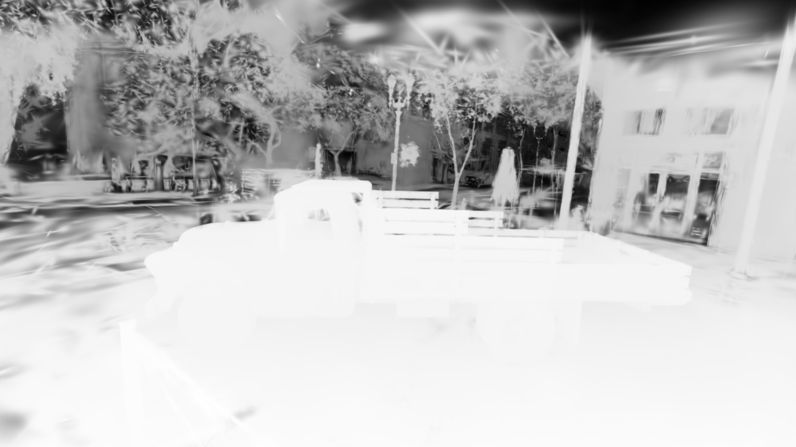
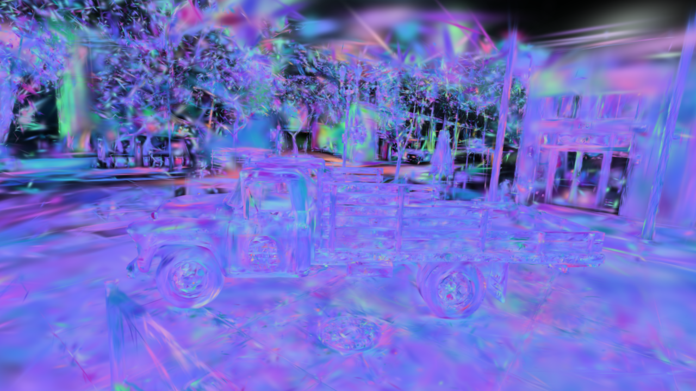

# Interactive Viewer

MLX3D ships a browser-based viewer for **every scene type it can produce** —
Gaussian Splatting checkpoints, triangle meshes, point clouds, and NeRFs.
Frames are rendered server-side on the Apple GPU (splats go through the Metal
rasterization kernels, meshes through the tile-based hard rasterizer, points
through the splat-based point renderer) and streamed to a canvas page with
orbit / pan / zoom controls, a live control panel, display-mode switching, an
orbit gizmo, and one-click PNG export. No extra dependencies, nothing to
install.

<p align="center"></p>
<p align="center"><em>Truck checkpoint rendered by the same Gaussian renderer used by the browser viewer.</em></p>

## One command for any scene

`mlx3d-view` auto-detects the scene type from the file:

```bash
mlx3d-view point_cloud.ply      # 3DGS checkpoint, mesh, or point cloud (.ply)
mlx3d-view bunny.obj            # mesh (OBJ / PLY / glTF / GLB)
mlx3d-view scene.ply --kind points --background 1 1 1
```

This opens `http://127.0.0.1:8090` in your browser. From Python the same
auto-detection is available as `view_file`, alongside the type-specific
helpers:

```python
from mlx3d.viewer import view_file, view_gaussians, view_mesh, view_pointcloud

view_file("point_cloud.ply")            # picks the right viewer for you
view_gaussians(GaussianModel.load_ply("point_cloud.ply"))
view_mesh("bunny.obj")                   # or a Meshes object
view_pointcloud(points, colors)          # (N, 3) arrays, a Pointclouds, or a path
```

All helpers are blocking (Ctrl-C to stop); pass `serve=False` to get the
configured `Viewer` back instead of starting the server.

## Live controls

Every viewer exposes a control panel (top-right, toggle with `C`) built from
the scene type. The values are sent with each frame request, so they take
effect instantly — no restart:

| Scene | Controls |
|---|---|
| Gaussians | background, exposure, gamma, splat scale, SH degree, **clip plane** (axis + position) |
| Mesh | background, exposure, gamma, steerable light (azimuth / elevation), wireframe width |
| Point cloud | background, point size, exposure, gamma |
| NeRF | coarse / fine sample counts, near, far, exposure, gamma |

The clip plane is a debugging aid: pick an axis (`x` / `y` / `z`, negate for
the opposite side) and slide the cut to peel away Gaussians and inspect a
scene's interior. It applies to the RGB, depth, and alpha passes alike.

## Display modes

Switch render passes from the panel or with the number keys `1`–`9`:

- **Gaussians** — `rgb`, `depth` (turbo-colormapped expected depth), `alpha`
  (coverage), `mesh` (screen-space depth/alpha contours).
- **Mesh** — `rgb` (Phong), `normals`, `depth`, `wireframe`.

Depth and alpha use a forward-only Metal pass; they are inspection views, not
part of any differentiable training path.

<p align="center">
  
  
</p>

## Camera, gizmo, and export

- **Orbit gizmo** (bottom-right) shows the current world axes as you orbit.
- **Presets** — front / back / left / right / top / iso buttons snap the camera.
- **`⤓ PNG`** (or `P`) downloads a full-resolution PNG screenshot of the
  current view rendered losslessly server-side — not a downscaled canvas grab.
- **`⧉ Camera`** copies the current camera pose as JSON.
- Camera pose and all control values persist in `localStorage`, so a reload
  restores exactly where you were.

| Input | Action |
|---|---|
| drag | orbit |
| `shift` + drag, right-drag | pan |
| scroll / pinch | zoom |
| `1`–`9` | display mode |
| `R` | reset camera · `U` flip up axis (handy for COLMAP scenes) |
| `C` | controls panel · `H` help · `P` screenshot |
| `[` / `]` | max render resolution down / up |

The page adapts resolution automatically: while you drag it renders at reduced
resolution for responsiveness, then refines to full resolution when the camera
settles. When nothing changes no frames are requested at all — the GPU idles.
Identical settled frames are served from a small frame cache, so re-requests
cost nothing.

## Viewing a NeRF

```python
from mlx3d.viewer import view_nerf

view_nerf(model, near=2.0, far=6.0)   # model: a trained mlx3d.nn.NeRF
```

NeRF rendering is orders of magnitude heavier than splatting; the viewer
starts at half resolution and leans on adaptive degradation. Drop the sample
counts from the control panel for snappier interaction while framing a shot,
then raise them for a final look.

## Live training preview

`view_live_gaussians` returns a viewer you can refresh from a training loop;
call `publish(model, step, loss)` whenever a new preview should appear. The
training and HUD stats (step, loss, Gaussian count) update in the browser.

## Viewing anything else

`Viewer` works with any callback that maps a camera to an image. New callbacks
may take a second `params` argument to receive live control values; declare the
matching `controls` to render sliders for them:

```python
import mlx.core as mx
from mlx3d.viewer import Viewer
from mlx3d.renderer import render_points

points = ...   # (P, 3)
mx.eval(points)  # arrays captured by the callback must be evaluated

def render(cam, params):
    return render_points(cam, points, radius=params.get("point_size", 2.0))["image"]

viewer = Viewer(
    render,
    controls=[{"name": "point_size", "label": "Point size",
               "kind": "slider", "min": 0.5, "max": 8.0, "step": 0.25, "value": 2.0}],
)
viewer.serve(port=8090)
```

!!! warning "Threading note"
    Frames are rendered on HTTP handler threads, and MLX cannot evaluate lazy
    arrays that were created on a different thread. Call `mx.eval` on
    everything your callback captures before `serve()` — the `view_*` helpers
    already do this.
